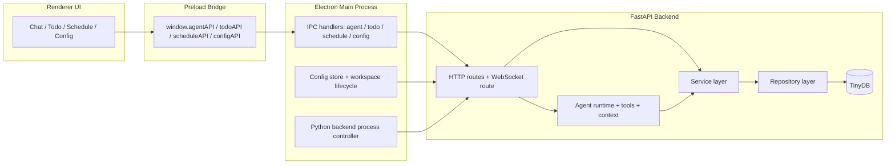
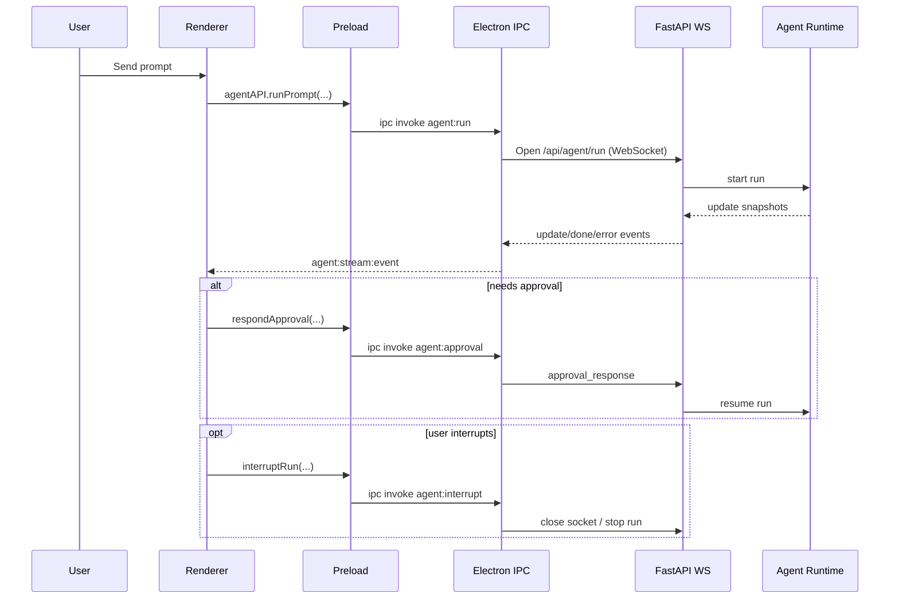
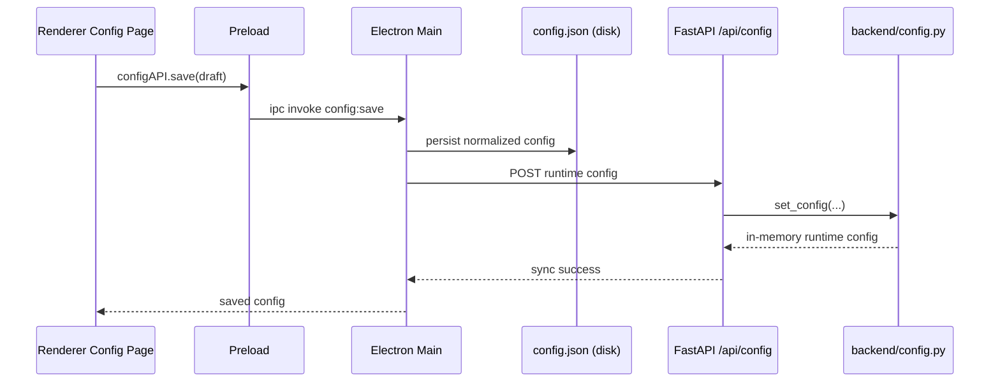
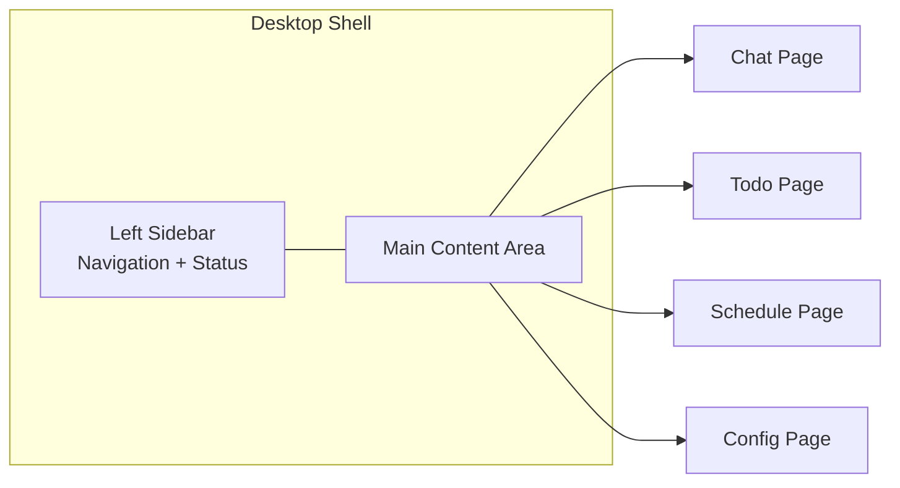
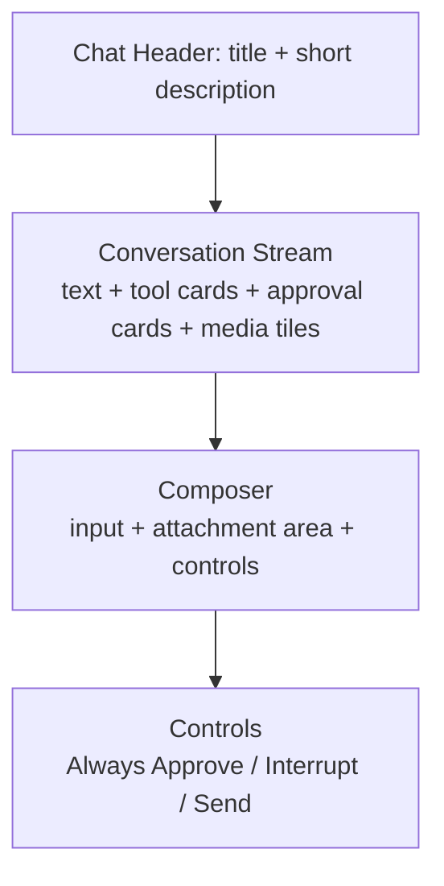
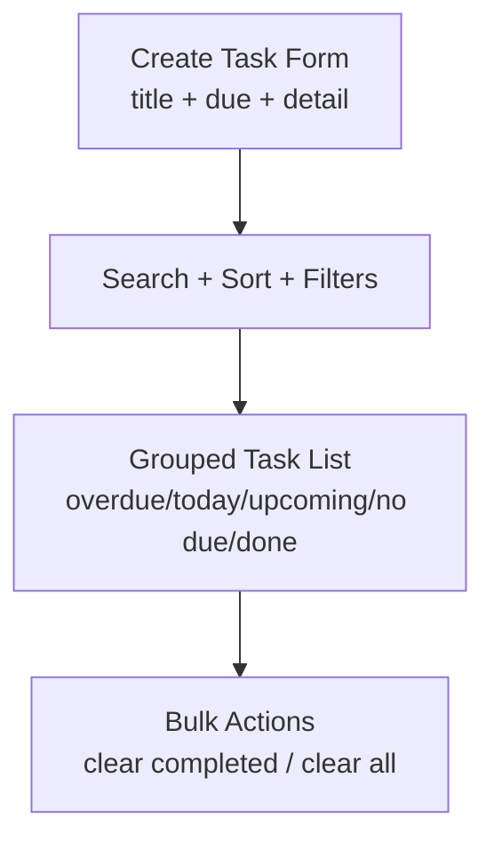
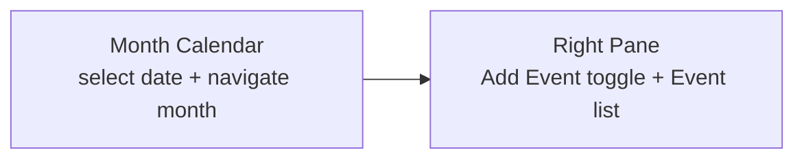
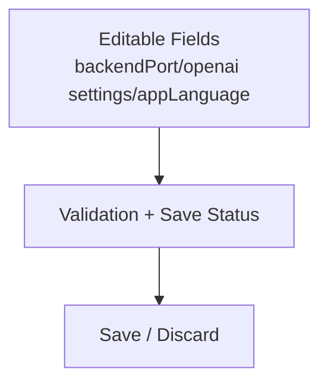

# Design 26S-29

This document provides design deliverables for architecture and UI.
It is a design artifact for report submission and is separate from implementation snapshots.

## 1. Software Architecture

### 1.1 Architecture Diagram

### 1.2 Role Of Each Component

| Component             | Role                                                                      | Notes                                       |
| --------------------- | ------------------------------------------------------------------------- | ------------------------------------------- |
| Renderer UI           | User-facing interaction for chat, todo, schedule, and config              | Keeps no direct backend process control     |
| Preload Bridge        | Trusted boundary exposed to renderer via safe APIs                        | Restricts renderer to explicit capabilities |
| Electron Main Process | App orchestration: IPC, backend process, config file, workspace lifecycle | Central integration point                   |
| FastAPI Routes        | Transport boundary for HTTP and WebSocket                                 | Validation and endpoint contracts           |
| Agent Runtime         | Streaming chat execution, tool calling, approval resume                   | Maintains run/session state                 |
| Services              | Business logic per domain                                                 | Keeps route handlers thin                   |
| Repositories + TinyDB | Persistence abstraction and local data storage                            | Swappable storage boundary                  |

### 1.3 Component Interaction (Primary Flows)

#### Chat Flow (streaming + approval)

#### Config Flow (file ownership and runtime sync)

### 1.4 Why This Architecture

- Clear runtime boundaries: UI, bridge, orchestration, backend API, business, persistence.
- Strong separation of concerns: each layer has a focused responsibility.
- Reduced coupling: renderer does not manage process lifecycle, files, or direct backend sockets.
- Better testability: routes, services, repositories, and Electron IPC can be tested independently.
- Practical desktop integration: local Python backend process control and runtime sync are centralized in Electron.

### 1.5 Hidden Assumptions And Constraints

- Backend host is local-only (`127.0.0.1`) in this project setup.
- This is a single-user desktop workflow, not a multi-tenant deployment.
- Local persistence is file-based and optimized for project scope, not high-concurrency production loads.
- Workspace artifacts are recreated on app startup by design.
- External model quality and network availability affect chat behavior.

## 2. UI Design

This section is UI design (wireframe-level), not implementation screenshots.
It focuses only on primary interfaces for major features.

### 2.1 Global App Layout

### 2.2 Chat UI Design

Design intent:
- Keep conversation and action trace in one place.
- Approval actions must be visible and immediately operable.
- Preserve readability for long assistant outputs.

### 2.3 Todo UI Design

Design intent:
- Fast capture first, management second.
- Grouping reduces scanning cost for students with many deadlines.

### 2.4 Schedule UI Design

Design intent:
- Date-centric planning with direct event operations.
- Keep event actions near event visibility to reduce context switching.

### 2.5 Config UI Design

Design intent:
- Keep runtime-sensitive configuration explicit.
- Make unsaved state and save result obvious.

### 2.6 UI Design Notes For Report

- Use this document's diagrams as the UI design artifact baseline.
- If the report requires image files, export each Mermaid diagram as PNG/SVG from Markdown preview.
- Do not use implementation snapshots as replacements for UI design artifacts.
