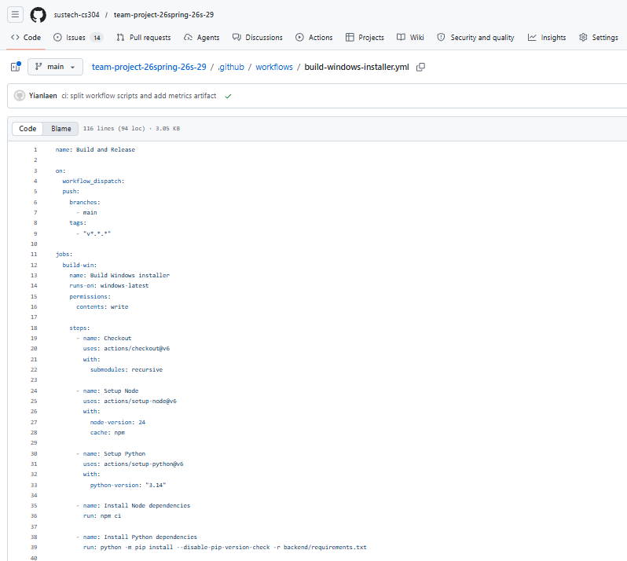
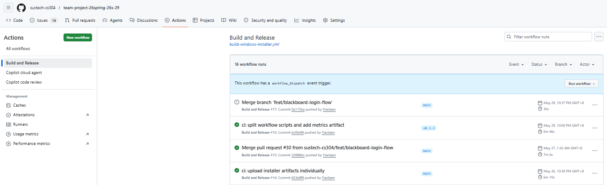
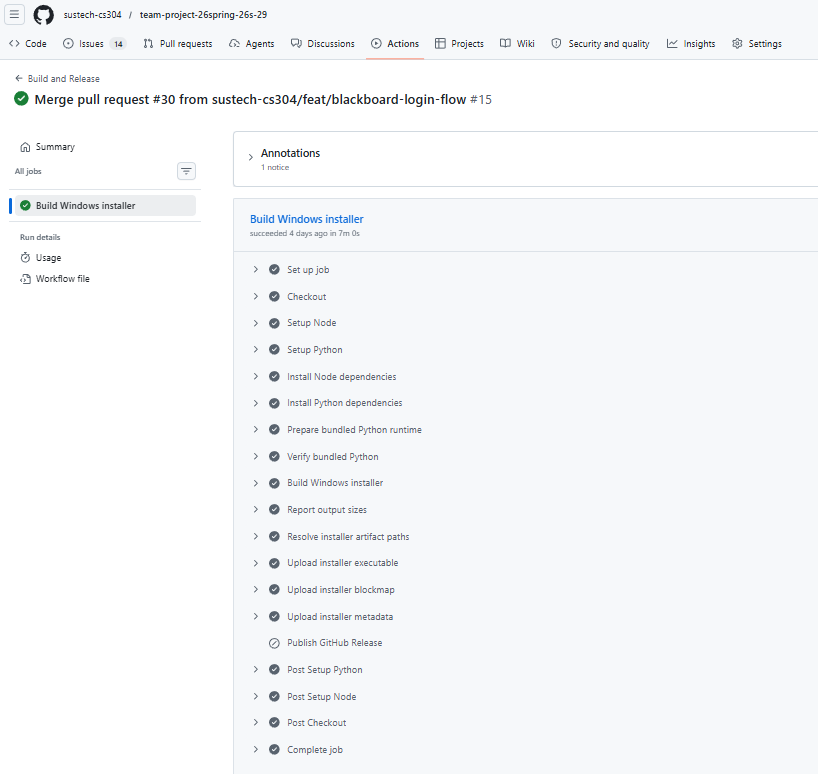

# Team Report

## 1. Project Overview

Our project is **SUSTech Student Assistant**, a local desktop application designed for Southern University of Science and Technology students. The application combines student productivity workflows with SUSTech-oriented campus information. Its main functions include:

- chatting with a Python-backed assistant;
- managing todos and due dates;
- managing schedule events;
- synchronizing Blackboard items into reviewed todo or schedule suggestions;
- searching and using SUSTech-oriented campus knowledge from the NanKe Manual corpus.

The system is implemented as a local Electron desktop application. The renderer layer uses HTML, CSS, and vanilla JavaScript; the desktop shell and IPC layer use Electron; the backend uses FastAPI; local persistence uses TinyDB. The repository also includes backend unit tests, Electron-side tests, documentation, CI scripts, and a Windows packaging workflow.

The runtime architecture is organized into the following layers:

```text
Renderer UI
  -> preload bridge
  -> Electron main process
  -> local HTTP / WebSocket boundary
  -> FastAPI backend
  -> services / repositories / TinyDB
```

This separation keeps UI code in `src/renderer/`, system and process control in `src/electron/`, and business logic plus persistence in `backend/`.

## 2. Metrics

The following metrics were generated from the project source code using the script `tools/ci/generate-metrics-report.ps1`. The generated result is stored in `metrics-report.txt`.

The measurement scope includes:

- included directories: `backend/`, `src/`, `tools/`;
- excluded directories: `tests/`, `vendor/`, `node_modules/`;
- included file types: `.py`, `.js`, `.mjs`, `.html`, `.css`.

| Metric | Value |
| --- | ---: |
| Lines of Code | 13,333 |
| Number of source files | 76 |
| Cyclomatic complexity | Average CCN 3.1 |
| Number of direct dependencies | 16 |

### 2.1 Dependency Breakdown

| Dependency Type | Count |
| --- | ---: |
| Node runtime dependencies | 2 |
| Node development dependencies | 2 |
| Python dependencies | 12 |
| Total direct dependencies | 16 |

The Node runtime dependencies are `katex` and `markdown-it`. The Node development dependencies are `electron` and `electron-builder`. The Python dependencies are listed in `backend/requirements.txt`, including FastAPI, Uvicorn, TinyDB, document-processing libraries, HTTP/parsing utilities, and the agent framework.

### 2.2 Cyclomatic Complexity Measurement

Cyclomatic complexity was measured by `lizard` with the following command:

```powershell
python -m lizard backend src tools -l python -l javascript
```

The report analyzed 772 functions and reported an average cyclomatic complexity number of 3.1. There were 13 high-complexity warnings. The warnings mainly appear in code paths that handle richer branching logic, such as agent message serialization, Blackboard item classification, schedule update validation, chat preview rendering, and corpus validation. These modules contain more conditional behavior because they need to validate user input, normalize structured content, or classify external data.

## 3. CI/CD Pipeline Description

The project uses **GitHub Actions** as the CI/CD platform. The purpose of the
pipeline is not to deploy a web service, but to produce a runnable **Windows
desktop application installer** for SUSTech Student Assistant. Because the final
artifact is a desktop app, the pipeline must assemble and verify all runtime
parts that the installed app depends on:

- the Electron desktop shell and renderer UI;
- the local Python/FastAPI backend;
- the SUSTech-oriented knowledge base built from the NanKe Manual corpus;
- a bundled Windows Python runtime so the app does not depend on a user's
  system Python installation;
- installer artifacts that can be downloaded from GitHub Actions or published
  as a GitHub Release.

The main workflow file is:

```text
.github/workflows/build-windows-installer.yml
```

Repository link:

```text
https://github.com/sustech-cs304/team-project-26spring-26s-29
```

Workflow configuration link:

```text
https://github.com/sustech-cs304/team-project-26spring-26s-29/blob/main/.github/workflows/build-windows-installer.yml
```

The workflow is named **Build and Release**. It runs on `windows-latest` and is triggered by:

- manual execution through `workflow_dispatch`;
- pushes to the `main` branch;
- version tags matching `v*.*.*`.

### 3.1 Pipeline Design

The pipeline is organized around the components that must be present in the
final desktop application:

| Stage | What it prepares or validates | Why it is required for the desktop app |
| --- | --- | --- |
| Source and dependency setup | Checks out the repository with submodules, installs Node.js dependencies with `npm ci`, and installs Python dependencies from `backend/requirements.txt`. | The desktop app is split across JavaScript/Electron and Python/FastAPI. Both dependency sets must be reproducible before the app can be tested or packaged. |
| Frontend and Electron validation | Runs JavaScript syntax checks and Electron-side tests. | The installed app starts from Electron, renders the UI from `src/renderer/`, and communicates through preload/IPC code in `src/electron/`. A broken renderer or IPC layer would make the desktop app unusable even if the backend works. |
| Backend validation | Compiles Python source and runs backend tests. | The installed desktop app starts a local FastAPI backend for chat, todos, schedules, Blackboard sync, workspace tools, and agent actions. Backend failures must be caught before packaging because users will not run the backend separately. |
| Knowledge base preparation | Builds and validates the SUSTech manual corpus through the `build:sustech-manual` flow. | Campus knowledge is a shipped product feature, not an external service. The installer must include a usable local corpus so the assistant can search SUSTech-oriented content after installation. |
| Bundled runtime preparation | Prepares `vendor/windows-python/` and verifies that the bundled Python runtime can run the backend. | A Windows desktop installer should work on machines without a preinstalled Python environment. The packaged app therefore carries its own Python runtime and backend dependencies. |
| Installer build | Runs `npm run package:win`, which calls `electron-builder` to produce the Windows NSIS installer. | This stage combines the Electron app, renderer assets, backend source, bundled Python runtime, and built knowledge corpus into the distributable desktop app. |
| Artifact and release publication | Uploads the installer, optional blockmap/metadata, and metrics report; publishes a GitHub Release only for version tags. | Every successful run keeps downloadable build artifacts, while tagged versions become formal release builds for users or evaluators. |

This structure matches the product architecture. A server-only pipeline would be
insufficient because the deliverable is not a backend deployment; it is a local
desktop application with its own UI, backend, runtime, persistent local data,
and bundled knowledge resources.

### 3.2 Validation Coverage

The validation stage uses the `npm test` script defined in `package.json`:

```powershell
npm run test:backend && npm run test:electron
```

The backend test command is:

```powershell
python -m unittest discover -s tests -v
```

The Electron-side test command is:

```powershell
node --test tests/electron/*.test.js
```

Therefore, the CI test stage covers both the Python backend and the Electron/Node integration layer. Backend tests validate APIs, repositories, services, agent adapters, agent runtime behavior, Blackboard logic, todo logic, workspace tools, and SUSTech manual corpus behavior. Electron tests validate IPC, app paths, backend process management, configuration/workspace handling, external links, i18n, attachment staging, and packaging configuration.

Syntax checks run before the tests:

- `python -m compileall backend tools tests` detects Python syntax errors in
  the backend, scripts, and tests;
- `tools/ci/check-node-syntax.ps1` validates JavaScript files used by Electron,
  the renderer, and Electron-side tests.

The workflow also generates `metrics-report.txt` with source lines, file count,
dependency count, and cyclomatic complexity. This report is not required to run
the app, but it gives the team a repeatable measurement artifact for the final
project report.

### 3.3 Packaging and Release Flow

The packaging stage first prepares the Windows Python runtime. This step is
important because the installed Electron app launches the backend from packaged
resources instead of relying on `python` from the user's `PATH`. The workflow
then verifies that this bundled runtime is usable before creating the installer.

The actual installer build uses:

```powershell
npm run package:win
```

This command first builds the SUSTech manual corpus and then invokes `electron-builder`:

```powershell
npm run build:sustech-manual && electron-builder --win nsis --publish never
```

This command shows the two product-specific packaging requirements: the local
knowledge base is built before packaging, and `electron-builder` then creates
the NSIS Windows installer from the desktop app configuration in `package.json`.
The configuration copies `src/` into the Electron app, copies `backend/` into
packaged resources, and copies the prepared Python runtime into packaged
resources as well.

After the build, helper scripts report output sizes and resolve the exact paths
of generated installer artifacts. The workflow uploads the installer executable
and optional blockmap/metadata as GitHub Actions artifacts. When the workflow is
triggered by a version tag such as `v0.3.2`, the final step publishes those
artifacts to GitHub Releases. In short, normal runs provide CI feedback and
downloadable build artifacts; tagged runs act as the release path for the
desktop application.

## 4. Snapshots provided

```text
Figure 1. GitHub Actions workflow configuration for building and releasing the Windows installer.
```



```text
Figure 2. Successful execution of the Build and Release GitHub Actions workflow.
```



```text
Figure 3. CI job logs and uploaded artifacts produced by the successful pipeline run.
```




## 5. Summary

The project contains 13,333 lines of source code across 76 source files, with an average cyclomatic complexity of 3.1 and 16 direct dependencies. Its CI/CD pipeline is implemented with GitHub Actions on Windows and is designed around the actual release target: a packaged desktop application. The pipeline validates the Electron frontend, the Python/FastAPI backend, and the SUSTech knowledge corpus, then prepares a bundled Python runtime and builds a Windows installer. Successful runs upload installer and metrics artifacts, while version-tagged runs publish the installer through GitHub Releases.
